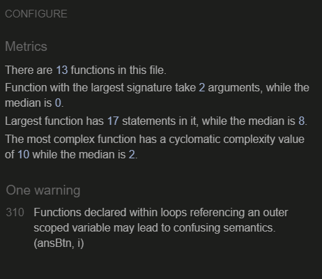

# World of Warcraft Quiz game
# Milestone Project 2

Active website: https://cloki0610.github.io/CI-Portfolio-Project-2/
You can also click [here](https://cloki0610.github.io/CI-Portfolio-Project-2/) to the living website.
## **Purpose**
This website provide a simple question quiz game to test the user knowledge about World of Warcraft, another famous MMORPG in the world.

User will answer five random question and take the final score that shows how much they know about the game.

User can play the game with mouse or by keyboard.
## **Features**
### **Existing Feature**
The following website concluded two pages, 
* index.html for the functional quiz game,
* 404.html for the error page.
#### **index.html**
##### **Header**
A simply header shows the title to let user know what he will play.
##### **Welcome section**

The first part of script in handleWelcome() contain four elements:
* Label - a descriptive label to let user know what he should do.
* Input field  - to let user input a username.
* 'START' button -  to begin a new quiz.
* 'HOW TO PLAY' button - when user hover on the button, the instruction will show up to let user know how to play.

User can press the start button or press enter to begin a new game.

If user begin a new game without user name, a warning alert will appear.

Or if user input a name more than 10 character, another notification will let user know they should input a shorter name.
##### **Quiz in progress**

Current part of script in startQuiz() contain four elements:
* Welcome message - a line of text to display welecome message with the user name entered by user.
* Question - a line of text to display the current question
* Answers - four buttons with four possible answers 
* current results - display current answer and how may question left.

When user begin a new quiz game, the script will take the username input , 

remove the DOM display in welcome section and show a welcome message with the input text.

Then the script will sort the question array to randomize the questions.

After that the script will call another function to show the first question in array with 4 possible answer show as button.

User can choose the answer by press the buttons or press 'a', 'b', 'c', 'd' on the keyboard(case insensitive).

When user choose their answer, the script will call the nextQuestion function to check their answer by checkAnswer() function and display the new current score on the result section.

If current question is the last question, the script will move to final result section.
##### **Show final result**

Current part of script in submitQuiz() contain two elements:
* The final score with a result message
* A try again button to restart a new quiz game

First, the script will remove all the previous elements and take the score as variable.

Then the script will display the final score with specific message base on their score,

and display 'Try again' message with a retry button beneath the result messages.

When user press the button or press 'Enter' on the keyboard,

the script will remove all the DOM and display the welcome section as the beginning of the game.
#### **404.html**

A page for invalid links in this website.

This page contain a header and footer as index.html,

error messages and a return button to redirect user to previous page.

### **Feature left to be implement**
* A user input form to let user add customer question to the quiz game.
* Put all the questions to a external datebase.

## **Testing**
### **Functional Test**
* Username input is functional, if input is null or more than 10 character, the script will show correct alert message.
* Answer buttons are all functional, and count the score correctly.
* The final result shows the correct score and the correct message base on the final score.
* The retry button correctly back to the welcome section.
* The button in 404.html correctly back to previous page. 
### **Responsive Design**
* All responsive design are seems right in place. 
I used google DevTools to check different size of screens and their responsive design.
### **Validator Testing**
I use the following validator for testing:
* [HTML - W3C HTML Validator](https://validator.w3.org/)
* [CSS - Jigsaw CSS Validator](https://jigsaw.w3.org/css-validator/)
* [JSHint](https://jshint.com/)
#### HTTP test
All script have been tested without important error.

#### CSS test
The script passed test without error.

#### Javascript test
All script have been tested without significant issues.
This testing assume the script using the ES6 feature.
But there are still a warning in line: 310,
I can put this keyword in those variable for pass the test,
but it will disable the button because the script cannot find the DOM element.

#### LightHouse
Lighthouse in Chrome Dev Tools have been used for test the performance of the website.

## **Bugs**
### **Solved Bugs**
* HTML tag (index.html line: 27 & 31)

The html validator spot an issue and said the div tag should not be the child of button.

The solution is change 
 tag into  tag.
* Responsive problems

In the previous version, the footer are not correctly display on the bottom of the screen,

or display on the bottom of the screen but covered the main content.

At last with mentor's help, I use a solution from css-tricks.com to fix this problem.
### **Unfixed Bugs**
Maybe some offset issues still extist, but I have try my best to solve it.

## **Deployment**
The website use git for version control, and deploy in Github by following step:

* This website create from Code Institue [template for Gitpod](https://github.com/Code-Institute-Org/gitpod-full-template).
* Every change in this project commit by the VS Code source control function in Gitpod.
* Git push command was used to push all committed changes to the GitHub repository.
* When the website almost complete, I login to my GitHub Repository Setting page.
* In the Page section I click the dropdown list under "Scource" and select "main".
* After press the "Save" button, the website will be deploy.

## **Credit:**
### **Content**
* https://quizizz.com/admin/quiz/5bacebf0def5440019d49e0f/world-of-warcraft-trivia-moderate-difficulty
All the question in this game come from this quiz test. Some question and answer have been changed because of new patch and expansion.
### **Media**
* https://www.reddit.com/r/wow/comments/906m3p/bfa_icon_for_wow/
The icon shortcut in this website come from reddit.
### **Code**
* https://www.sitepoint.com/simple-javascript-quiz/
Through this turtorial I get the basic idea about how this game functional,
It help me to make up my Idea to create my own quiz game.
* https://codepen.io/ericwshea/pen/EyzZQg
I use this codepen work in my website when I'm stuck about CSS animation after a new DOM added to the page.
* https://www.w3schools.com/css/css_dropdowns.asp
I learn from w3school for how to make a dropdown.
* https://css-tricks.com/couple-takes-sticky-footer/
The final solution to solve the responsive issues.
### **Tools**
* Chrome Lighthouse and Chrome Developer Tools
* HTML - W3C Validator
* CSS - Jigsaw Validator
* Git
* Gitpod
* Github

### **Acknowledgment**
Again, thanks to my mentor Daisy McGirr for all support and guidance in the process.